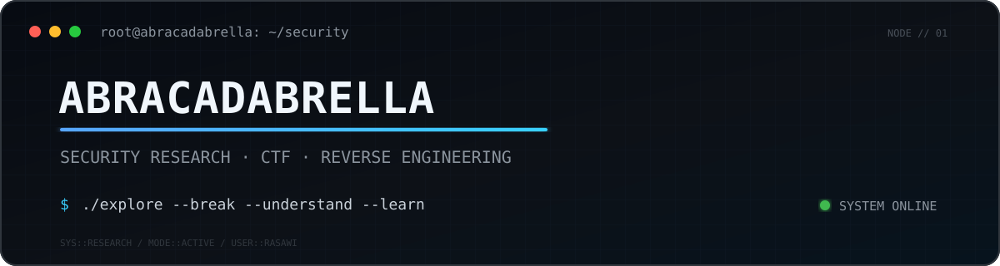

<div align="center">

<picture>
  <source media="(prefers-color-scheme: dark)" srcset="./assets/banner-dark.svg">
  <source media="(prefers-color-scheme: light)" srcset="./assets/banner-light.svg">
  
</picture>

<br>

### Security Researcher · CTF Player · Builder

`Reverse Engineering` · `Cryptography` · `Web Security` · `Digital Forensics`

</div>

---

```text
┌──(Abracadabrella㉿github)-[~]
└─$ whoami

RaSaWi

┌──(Abracadabrella㉿github)-[~]
└─$ cat focus.txt

[+] Capture The Flag
[+] Reverse Engineering
[+] Cryptography
[+] Web Security
[+] Digital Forensics
[+] Security Tool Development
```


I explore systems by taking them apart and understanding the assumptions
that make them work.

My current playground is CTF — especially reverse engineering,
cryptography, web security, and digital forensics.

I also build small tools to automate the boring parts.

```text
root@Abracadabrella:~# curiosity --never-stop
```


```yaml
main:
  - Capture The Flag
  - Reverse Engineering
  - Cryptography

exploring:
  - Web Security
  - Digital Forensics
  - Binary Exploitation

building:
  - Security Tools
  - Automation
  - CTF Utilities
```


```text
Languages
├── Python
├── C / C++
├── Rust
├── JavaScript
└── Bash

Reverse Engineering
├── Ghidra
├── GDB
├── JADX
├── objdump
└── strings

Security
├── Burp Suite
├── Wireshark
├── CyberChef
└── Linux
```
